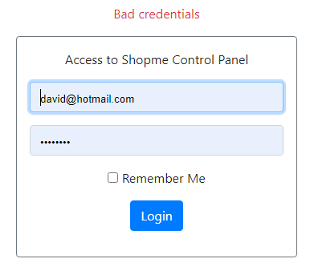
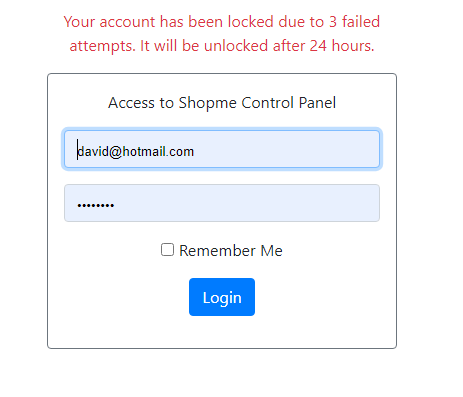
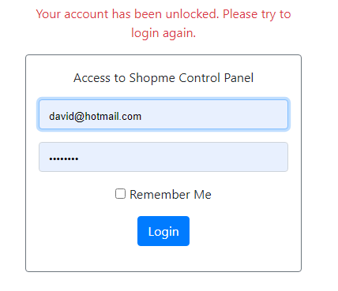

# Spring Security Limit Login Attempts Example


You will learn how to implement the limit login attempts function with the following strategy:

* A user can login failed 3 times maximum. His account will be locked on the last failed attempt.
* The user account is locked during 24 hours. That means after this duration the user account will be unlocked (upon the next login attempt).


## 1. Update Users table and User Entity Class


Suppose that the user information is stored in a table named users. You need to add 3 extra columns in order to implement the limit login attempt function. They are:

* failed_attempt: a small integer number that indicates the number of failed login attempts. The user’s account will be locked if failed_attempt > 2. The default value is 0.
* account_non_locked: a boolean value that indicates the user’s account is locked or not. Spring Security will reject login of a locked account. The default value is true (1 in MySQL).
* lock_time: a date time value that indicates the time at which the user’s account is locked. Based on this value the application can determine when the lock expires and unlock the user’s account. The default value is null.

```
import javax.persistence.*;
 
@Entity
@Table(name = "users")
public class User {
    @Id
    @GeneratedValue(strategy = GenerationType.IDENTITY)
    private Integer id;
   
    private String email;
   
    private String password;
   
    private String firstName;
   
    private String lastName;
   
    private boolean enabled;
   
    @Column(name = "account_non_locked")
    private boolean accountNonLocked;
   
    @Column(name = "failed_attempt")
    private int failedAttempt;
   
    @Column(name = "lock_time")
    private Date lockTime;
 
    // constructors...
   
    // getters...
   
    // setters...
}
```


## 2. Update UserDetails Class

When implementing authentication using Spring Security, you already created a class of type UserDetails to hold details of an authenticated user. So make sure that the isAccountNonLocked() method is updated as follows:

```
public class MyUserDetails implements UserDetails {

    private User user;

    public MyUserDetails(User user) {
        this.user = user;
    }


    @Override
    public boolean isAccountNonLocked() {
        return user.isAccountNonLocked();
    }

}
```


## 3. Update User Repository and Service Classes

Next, you need to declare a method in the UserRepository class to update the number of failed login attempts for a user based on his email, as follows:

```
public interface UserRepository extends JpaRepository<User, Long> {

    Optional<User> findByEmail(String email);

    Optional<User> findByResetPasswordToken(String token);

    @Modifying
    @Query("UPDATE  User u SET u.failedAttempt = ?1 WHERE u.email = ?2")
    void updateFailedAttempts(int attempts, String email);
}
```


As you can see, we use a custom query (JPA query).

And update the business class UserServices by implementing 4 new methods and a couple of constants, as follows:


```
@Transactional
@Service
public class UserService {


    public static final int MAX_FAILED_ATTEMPTS = 3;

    private static final long LOCK_TIME_DURATION = 24 * 60 * 60 * 1000; // 24 hours

    @Autowired
    private UserRepository userRepository;

    @Autowired
    private PasswordEncoder passwordEncoder;


    public User getByEmail(String email){
        return userRepository.findByEmail(email).orElseThrow(()-> new UsernameNotFoundException("no user found"));
    }

    public void updateResetPasswordToken(String token, String email) throws UsernameNotFoundException {
        User user = userRepository.findByEmail(email).orElseThrow(() -> new UsernameNotFoundException("no user found"));
        user.setResetPasswordToken(token);
        userRepository.save(user);
    }

    public User getByResetPasswordToken(String token) {
        return userRepository.findByResetPasswordToken(token).orElseThrow(() -> new UsernameNotFoundException("no user found"));
    }

    public void updatePassword(User user, String newPassword) {
        String encodedPassword = passwordEncoder.encode(newPassword);
        user.setPassword(encodedPassword);
        user.setResetPasswordToken(null);
        userRepository.save(user);
    }

    public void increaseFailedAttempts(User user) {
        int newFailedAttempts = user.getFailedAttempt() + 1;
        userRepository.updateFailedAttempts(newFailedAttempts, user.getEmail());
    }

    public void resetFailedAttempts(String email){
        userRepository.updateFailedAttempts(0, email);
    }

    public void lock(User user){
        user.setAccountNonLocked(false);
        user.setLockTime(new Date());
        userRepository.save(user);
    }

    public boolean unlockWhenTimeExpired(User user){
        long lockTimeInMilis = user.getLockTime().getTime();
        long currentTimeInMilis = System.currentTimeMillis();

        if(lockTimeInMilis + LOCK_TIME_DURATION < currentTimeInMilis){
            user.setAccountNonLocked(true);
            user.setLockTime(null);
            user.setFailedAttempt(0);
            userRepository.save(user);
            return true;
        }
        return false;
    }
}
```

Let me explain this new code. First, we declare the maximum number of failed login attempts allowed:

```
public static final int MAX_FAILED_ATTEMPTS = 3;
```

And duration of the lock time in milliseconds:

```
private static final long LOCK_TIME_DURATION = 24 * 60 * 60 * 1000; // 24 hours
```

So it would be easy to configure/change the maximum allowed failed logins and lock duration. And let’s come to the new methods:

* increaseFailedAttempts(): this method updates the number of failed attempts of a user. It is called each time the user fails to login (e.g. providing wrong username or password).
* resetFailedAttempts(): sets the number of failed attempts to zero. This method will be called when the user has logged in successfully.
* lock(): locks the user’s account if the number of failed logins reach the maximum allowed times.
* unlockWhenTimeExpired(): unlocks the user’s account when lock duration expires, allowing the user to login as usual.


## 4. Update Login Page

In your custom login page, ensure that it contains the following code snippet to display the exception message upon failed login.

```
<div th:if="${param.error}">
    <p class="text-danger">[[${session.SPRING_SECURITY_LAST_EXCEPTION.message}]]</p>
</div>
```

It’s important to have this code in the login page, so it will show the original error message generated by Spring Security.


## 5. Code Authentication Failure Handler

Next, we need to code a custom authentication failure handler class to intervene the authentication process of Spring Security in order to update the number of failed login attempts, lock and unlock the user’s account. So create a new class CustomLoginFailureHandler with the following code:

```
@Component
public class CustomLoginFailureHandler extends SimpleUrlAuthenticationFailureHandler {

    @Autowired
    private UserService userService;

    @Override
    public void onAuthenticationFailure(HttpServletRequest request, HttpServletResponse response, AuthenticationException exception) throws IOException, ServletException {
        String email = request.getParameter("u");
        User user = userService.getByEmail(email);

        if (user != null) {
            if (user.isEnabled() && user.isAccountNonLocked()) {
                if (user.getFailedAttempt() < UserService.MAX_FAILED_ATTEMPTS - 1) {
                    userService.increaseFailedAttempts(user);
                } else {
                    userService.lock(user);
                    exception = new LockedException("Your account has been locked due to 3 failed attempts."
                            + " It will be unlocked after 24 hours.");
                }
            } else if (!user.isAccountNonLocked()) {
                if (userService.unlockWhenTimeExpired(user)) {
                    exception = new LockedException("Your account has been unlocked. Please try to login again.");
                }
            }

        }

        super.setDefaultFailureUrl("/login?error");
        super.onAuthenticationFailure(request, response, exception);
    }
}
```


Let me explain this code. First, it gets a User object based on the email which was entered in the login page. If the user is found in the database and the user is enabled and non-locked:

* Increase the number of failed login attempts if it has not reached the maximum allowed times, else:
* Lock the user’s account if the failed login times is equal or greater than the maximum allowed times.

And in case the user’s account is locked, it will try to unlock the account if lock duration expires.

Note that we throw LockedException (defined by Spring Security) with custom error message that will be displayed in the login page.


## 6. Code Authentication Success Handler


There can be a case in which the user fails to login the first time (or second time) but successful on the next time. So the application should clear the number of failed login attempts immediately after the user has logged in successfully.

To do so, you need to create a custom authentication handler class with the following code:

```
@Component
public class CustomLoginSuccessHandler extends SimpleUrlAuthenticationSuccessHandler {


    @Autowired
    private UserService userService;

    @Override
    public void onAuthenticationSuccess(HttpServletRequest request, HttpServletResponse response, Authentication authentication) throws IOException, ServletException {
        MyUserDetails myUserDetails = (MyUserDetails) authentication.getPrincipal();
        User user = myUserDetails.getUser();
        if(user.getFailedAttempt() > 0){
            userService.resetFailedAttempts(user.getEmail());
        }
        super.onAuthenticationSuccess(request, response, authentication);
    }
}
```


## 7. Update Spring Security Configuration Class

And to enable the custom authentication failure and success handlers above, you need to update the Spring Security configuration class as follows:

```
@Override
    protected void configure(HttpSecurity http) throws Exception {
        http.authorizeRequests()
                .antMatchers("/", "/login**","/forgot_password", "/reset_password").permitAll()
                .antMatchers("/new").hasAnyAuthority("ADMIN", "CREATOR")
                .antMatchers("/edit/**").hasAnyAuthority("ADMIN", "EDITOR")
                .antMatchers("/delete/**").hasAuthority("ADMIN")
                .anyRequest().authenticated()
                .and().formLogin()
                .loginPage("/login") // custom login url
                .usernameParameter("u") // custom login form username name
                .passwordParameter("p") //custom login form password name
                .successHandler(customLoginSuccessHandler)
                .failureHandler(customLoginFailureHandler)
                .permitAll()
//                .failureUrl("/loginerror") //custom error login redirection page
//                .defaultSuccessUrl("/loginsuccess") //custom success login redirection page
                .and().logout().permitAll();
//                .logoutSuccessUrl("/logoutsuccess"); //custom logout redirection page
    }
```


## 8. Test Limit Login Attempts Function


Before testing, ensure that the new columns have default values: 0 for failed_attempt, true for account_non_locked and null for lock_time.

Start your Spring Boot application and go to the login page. Enter a correct username but wrong password, you would see the following error at the first failed login attempt:




Check the database and you should see failed_attempt = 1. Now try to login with a wrong password again. You would see the same error, but failed_attempt = 2.

Next, try to make the third failed login, it says the user’s account has been locked:




Check the database, and you should see failed_attempt = 2, account_non_locked = 0 (false) and lock_time is set to a specific time.

Then the user won’t be able to login during 24 hours since his account is locked.

Wait for the lock time expires (for quick testing, you can change the lock time duration to 5 minutes), and login again with correct credentials. The user will see this screen:



And the user must login again (with correct credentials). Check the database and you should see values of the new 3 columns have been set to default values.
