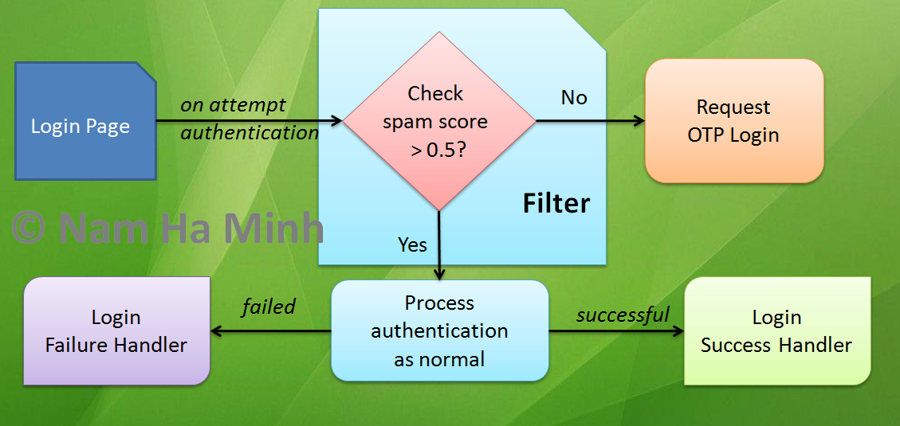

# Spring Security Before Authentication Filter Examples

how to intercept the authentication process of Spring Security in order to run custom logics just before the authentication takes place. In practice, we need to do the following tasks before authentication:


* Check the spam score (using Google ReCaptcha API) of the current login request to decide whether to require OTP (One-Time Password) or not.
* Clear failed login attempts if the lock already expired.
* Any custom logics that need to be executed just before authentication.

The following diagram helps you understand the workflow under the context of Spring Security’s authentication process:



As you can see, it requires to setup a custom filter that is executed before Spring Security filter. This custom filter will override all the existing configurations for login success handler, login failure handler and logout success handler. That means when you configure a before authentication filter, you need to configure those handlers in this filter (if needed).


## 1. Simple Before Authentication Filter Configuration


Suppose that you have an existing Spring Boot project with the login function already implemented. And now you want to configure a before authentication filter.

First, you need to create a new class that extends the UsernamePasswordAuthenticationFilter class as follows:

```
public class CustomBeforeAuthenticationFilter extends UsernamePasswordAuthenticationFilter {
    public CustomBeforeAuthenticationFilter() {
        setUsernameParameter("email");
        super.setRequiresAuthenticationRequestMatcher(new AntPathRequestMatcher("/login", "POST"));
    }

    @Override
    public Authentication attemptAuthentication(HttpServletRequest request, HttpServletResponse response) throws AuthenticationException {
        String email = request.getParameter("email");
        System.out.println("The user " + email + " is about to login");
        return super.attemptAuthentication(request, response);
    }
}
```


You see, the code in the constructor sets username parameter to “email” because the custom login page uses “email” as name of the username field; and it this filter is configured to be invoked only for the request /login with HTTP POST method.

And the callback method is attemptAuthentication() which will be executed right before Spring Security authenticates the user – this method is where you put the custom logics. And finally it should call super.attemptAuthentication() to delegate processing to the Spring Security filter.

And configure this filter in the Spring security configuration class as follows:

```
@Configuration
@EnableWebSecurity
public class WebSecurityConfig extends WebSecurityConfigurerAdapter {


    @Override
    protected void configure(AuthenticationManagerBuilder auth) throws Exception {
        auth.authenticationProvider(daoAuthenticationProvider());
    }

    public DaoAuthenticationProvider daoAuthenticationProvider() {
        DaoAuthenticationProvider daoAuthenticationProvider = new DaoAuthenticationProvider();
        daoAuthenticationProvider.setUserDetailsService(userDetailsService());
        daoAuthenticationProvider.setPasswordEncoder(passwordEncoder());
        return daoAuthenticationProvider;
    }

    @Bean
    public UserDetailsService userDetailsService() {
        return new UserDetailsServiceImpl();
    }

    @Bean
    public PasswordEncoder passwordEncoder() {
        return new BCryptPasswordEncoder();
    }

    @Override
    protected void configure(HttpSecurity http) throws Exception {
        http.authorizeRequests()
                .antMatchers("/").permitAll()
                .antMatchers("/new").hasAnyAuthority("ADMIN", "CREATOR")
                .antMatchers("/edit/**").hasAnyAuthority("ADMIN", "EDITOR")
                .antMatchers("/delete/**").hasAuthority("ADMIN")
                .anyRequest().authenticated()
                .and()
                .addFilterBefore(getBeforeAuthFilter(), CustomBeforeAuthenticationFilter.class)
                .formLogin()
                .loginPage("/login") // custom login url
                .usernameParameter("u") // custom login form username name
                .passwordParameter("p") //custom login form password name
                .permitAll()
//                .failureUrl("/loginerror") //custom error login redirection page
//                .defaultSuccessUrl("/loginsuccess") //custom success login redirection page
                .and().logout().permitAll();
//                .logoutSuccessUrl("/logoutsuccess"); //custom logout redirection page
    }

    public UsernamePasswordAuthenticationFilter getBeforeAuthFilter() throws Exception {
        CustomBeforeAuthenticationFilter filter = new CustomBeforeAuthenticationFilter();
        filter.setAuthenticationManager(authenticationManager());
        filter.setAuthenticationFailureHandler(new SimpleUrlAuthenticationFailureHandler() {
            @Override
            public void onAuthenticationFailure(HttpServletRequest request, HttpServletResponse response, AuthenticationException exception) throws IOException, ServletException {
                System.out.println("Login error: " + exception.getMessage());
                super.setDefaultFailureUrl("/login?error");
                super.onAuthenticationFailure(request, response, exception);
            }
        });
        return filter;
    }
}
```

As you can see, a custom before authentication filter is configured in the getBeforeAuthenticationFilter() method. And it is required to set the authentication manager and authentication failure handler for this filter (if not, failed login attempt will cause an error). The addFilterBefore() method of the HttpSecurity class will register the custom filter before Spring security filter.
