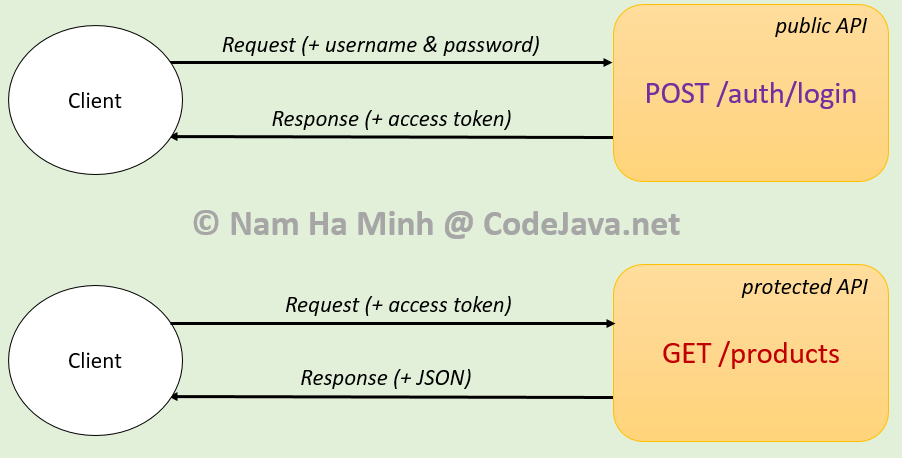
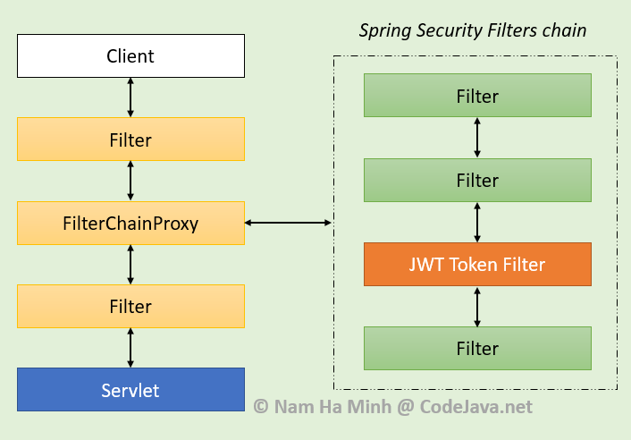

# Spring Security JWT Authentication Tutorial

JSON Web Token (JWT) is widely used for securing REST APIs, in terms of securely transmitting tokens along with HTTP requests, which facilitates stateless and secure communication between REST clients and API backend.

In this tutorial, I’m happy to guide you through the development of securing REST API end points using JWT and Spring Security in a Spring-based application, from scratch. We’ll develop an API that authenticates a client and generates an JWT token which is then used to access some protected APIs, as depicted in the following diagram:



In this kind of Spring Security JWT starter guide, you’ll learn code a Java Maven project based on the following technologies: Spring Boot, Spring Web, Spring Security, Spring Data JPA, MySQL JDBC, Spring Validation, JSON Web Token.

To follow this tutorial, you need to have the following software programs: Java Development Kit (JDK), any Java IDE (I prefer Spring Tool Suite), MySQL Community Server, curl or Postman (for API testing).

## [1. Understand JSON Web Token]()

JSON Web Token (JWT) is an open standard ([RFC 7519](https://datatracker.ietf.org/doc/html/rfc7519)) that defines a compact and self-contained way for securely transmitting information between parties as a JSON object.

A JWT is a string representing a *set of claims* as a JSON object. A claim is represented as a name/value pair consisting of a claim name and a claim value. A claim name is always a string, and a claim value can by any JSON value.

JWTs are *compact* so they can be used easily in space constrained environments such as HTTP Authorization headers and URI query parameters. More importantly, the information in JWTs can be verified and trusted because it is *digitally signed* using a secret key or a public/private RSA key pair.

The structure of a JWT consists 3 parts separated by dots: header, payload and signature.

The header describes the cryptographic operations applied to the JWT claims set - the type of algorithm used to sign the token. Here’s an example:

```
{"typ":"JWT",
 "alg":"HS256"}
```

The second part, payload contains claims which are a set of name/value pairs. Below is an example:

```
{
  "sub": "1234567890",
  "name": "Nam Ha Minh"
  "iss": "codejava.net",
}
```

Here, the claim names used are sub (subject), name (full name) and iss (issuer), which are of type registered claims - defined by IANA (Internet Assigned Numbers Authority). There are also public and private claims, but it’s recommended to use registered claims for interoperability.

The header and payload are *base64url encoded* before they are digitally signed to form the signature part. The algorithm specified in the header is used to sign the header and payload. For example, if the algorithm is HS256 (HMAC SHA256), then the signature will be created in the following way:

```
HMAC_SHA256(
    base64urlEncode(header) + "." +
    base64urlEncode(payload),
    secret
)
```

The secret is any key you create (typically a random combination of characters). As the signature is calculated using the header and the payload, the server can verify that a JWT sent by a client hasn’t been tampered with. The signature is also base64url encoded. So the final form of a JWT has this format:

    base64urlEncode(header) . base64urlEncode(payload) . signature
When a REST client invokes a protected API end point, it should put a JWT in the Authorization header of the request. If the server could verify the token, the request will be handled. Otherwise an HTTP status 401 (Unauthorized) is returned.

## [2. Understand Spring Security Filters chain]()

It’s also important to understand how Spring Security works at a glance, in order to understand how to implement JWT Authentication with Spring. When a client sends a request to the server, the request will go through a sequence of filters before reaching the destination servlet which is actually responsible for processing the request. Let’s look at the following diagram:



The Spring Web framework plugs in a special filter called *FilterChainProxy* that picks a chain of internal filters used by Spring Security, depending on the application’s security configuration. Each filter in the Spring Security filters chain is responsible for applying a specific security concern to the current request. If you enable debugging for a security configuration class like this:

```
@EnableWebSecurity(debug = true)
public class AppSecurityConfig  extends WebSecurityConfigurerAdapter { ... }
```
Then you will see, in the console, it reveals all the filters involved in the current request - for example:

```
Security filter chain: [
  WebAsyncManagerIntegrationFilter
  SecurityContextPersistenceFilter
  HeaderWriterFilter
  RequestCacheAwareFilter
  SecurityContextHolderAwareRequestFilter
  AnonymousAuthenticationFilter
  SessionManagementFilter
  ExceptionTranslationFilter
  FilterSecurityInterceptor
]
```
This list may differ, depending on security configuration and path of the current request. Note that the order of filters matters as they are called in the sequence they are registered with the servlet container. The filters used by Spring Security are internal to the framework and the container is not aware of them.

Having said that, we need to insert our own custom filter (e.g. JWT Token Filter) in the middle of Spring Security filters chain. This filter will check availability and verify integrity of the access token. If the token is verified, the request is passed through the downstream filters and finally reaching the destination handler. Otherwise, an Unauthorized error should be raised.

## [3. Required Dependencies]()

Make sure that you have the following dependencies included in the pom.xml file:

```
<dependency>
    <groupId>org.springframework.boot</groupId>
    <artifactId>spring-boot-starter-security</artifactId>
</dependency>
<dependency>
    <groupId>org.springframework.boot</groupId>
    <artifactId>spring-boot-starter-web</artifactId>
</dependency>
<dependency>
    <groupId>org.springframework.boot</groupId>
    <artifactId>spring-boot-starter-data-jpa</artifactId>
</dependency>
<dependency>
    <groupId>mysql</groupId>
    <artifactId>mysql-connector-java</artifactId>
    <scope>runtime</scope>
</dependency>
 
<dependency>
    <groupId>io.jsonwebtoken</groupId>
    <artifactId>jjwt</artifactId>
    <version>0.9.1</version>
</dependency>
 
<dependency>
    <groupId>org.springframework.boot</groupId>
    <artifactId>spring-boot-starter-validation</artifactId>
</dependency>
<dependency>
    <groupId>org.springframework.boot</groupId>
    <artifactId>spring-boot-starter-test</artifactId>
</dependency>
```
Let me explain why each dependency is used:

* spring-boot-starter-security: used to apply security to the application
* spring-boot-starter-web: used to implement RESTful webservices, REST APIs
* spring-boot-starter-data-jpa: used to query database with Spring Data JPA and Hibernate framework
* mysql-connector-java: MySQL JDBC driver
* jjwt: is the JWT library which we use to generate and verity JWT tokens
* spring-boot-starter-validation: used to validate values of a JavaBean’s fields which are JSON values in the request.
* spring-boot-starter-test: used for testing with JUnit and AssertJ

## [4. Configure Data Source Properties]()

Because we’re going to use MySQL database, so declare the following properties for data source in the application.properties file:

```
spring.datasource.url=jdbc:mysql://localhost:3306/productsdb
spring.datasource.username=root
spring.datasource.password=password
spring.jpa.hibernate.ddl-auto=update
spring.jpa.properties.hibernate.format_sql=true
spring.jpa.show-sql=true
spring.jpa.properties.hibernate.dialect=org.hibernate.dialect.MySQL8Dialect
```
Note that you must create a new database schema named  **productsdb** , and update username and password according to your MySQL configuration.

## [5. Code REST APIs with Spring Data JPA]()

Next, let’s code a couple of REST APIs. Firstly, code an entity class as follows:

```
package net.codejava.product;
 
import javax.persistence.*;
 
import javax.validation.constraints.NotBlank;
import javax.validation.constraints.NotNull;
 
import org.hibernate.validator.constraints.Length;
 
@Entity
@Table(name = "products")
public class Product {
    @Id @GeneratedValue(strategy = GenerationType.IDENTITY)
    private Integer id;
   
    @Column(nullable = false, length = 128)
    @NotNull @Length(min = 5, max = 128)
    private String name;
   
    private float price;
 
    // getters and setters are not shown for brevity
}
```
This is a pretty simple entity class annotated with some JPA annotations, to map with the **products** table in database. Note that I use @NotNull and @Length annotation for validation.

Since we’re using Spring Data JPA, declare the following repository interface:

```
package net.codejava.product;
 
import org.springframework.data.jpa.repository.JpaRepository;
import org.springframework.stereotype.Repository;
 
@Repository
public interface ProductRepository extends JpaRepository<Product, Integer> {
 
}
```
Then code the API class (Rest Controller) as follows:

```
package net.codejava.product;
 
import java.net.URI;
import java.util.List;
 
import javax.validation.Valid;
 
import org.springframework.beans.factory.annotation.Autowired;
import org.springframework.http.ResponseEntity;
import org.springframework.web.bind.annotation.*;
 
@RestController
@RequestMapping("/products")
public class ProductApi {
 
    @Autowired private ProductRepository repo;
   
    @PostMapping
    public ResponseEntity<Product> create(@RequestBody @Valid Product product) {
        Product savedProduct = repo.save(product);
        URI productURI = URI.create("/products/" + savedProduct.getId());
        return ResponseEntity.created(productURI).body(savedProduct);
    }
   
    @GetMapping
    public List<Product> list() {
        return repo.findAll();
    }
}

```
You see, this REST controller exposes 2 API end points:

* ***POST /products*** : persists information of a product into database. It returns HTTP 201 Created status if successful.
* ***GET /products*** : gets information of all products in the database.

At this time, we unsecure these APIs for early testing purpose. So code a security configuration class as follows:

```
package net.codejava;
 
import org.springframework.security.config.annotation.web.builders.HttpSecurity;
import org.springframework.security.config.annotation.web.configuration.EnableWebSecurity;
import org.springframework.security.config.annotation.web.configuration.WebSecurityConfigurerAdapter;
import org.springframework.security.config.http.SessionCreationPolicy;
 
@EnableWebSecurity
public class ApplicationSecurity extends WebSecurityConfigurerAdapter {
 
    @Override
    protected void configure(HttpSecurity http) throws Exception {
        http.csrf().disable();
        http.authorizeRequests().anyRequest().permitAll();
        http.sessionManagement().sessionCreationPolicy(SessionCreationPolicy.STATELESS);
    }
 
}
```
Because we don’t use classic web so disable CSRF and no session management needed. For early testing, all the requests are allowed without authentication.

## [6. Code JWT Token Utility Class]()

Next, let’s code a utility class that uses the jjwt library to generate an access token based on a given User object. So the early code looks like below:

```
package net.codejava.jwt;
 
import java.util.Date;
 
import org.springframework.beans.factory.annotation.Value;
import org.springframework.stereotype.Component;
 
import io.jsonwebtoken.Jwts;
import io.jsonwebtoken.SignatureAlgorithm;
import net.codejava.user.User;
 
@Component
public class JwtTokenUtil {
    private static final long EXPIRE_DURATION = 24 * 60 * 60 * 1000; // 24 hour
   
    @Value("${app.jwt.secret}")
    private String SECRET_KEY;
   
    public String generateAccessToken(User user) {
        return Jwts.builder()
                .setSubject(String.format("%s,%s", user.getId(), user.getEmail()))
                .setIssuer("CodeJava")
                .setIssuedAt(new Date())
                .setExpiration(new Date(System.currentTimeMillis() + EXPIRE_DURATION))
                .signWith(SignatureAlgorithm.HS512, SECRET_KEY)
                .compact();
           
    }
}

```
Here, the generateAccessToken() method creates a JSON Web Token with the following details:

* Subject is combination of the user’s ID and email, separated by a comma.
* Issuer name is CodeJava
* The token is issued at the current date and time
* The token should expire after 24 hours
* The token is signed using a secret key, which you can specify in the application.properties file or from system environment variable. And the signature algorithm is HMAC using SHA-512.

Update the application configuration file to specify the secret key. For example:

## [7. Code JWT Authentication API]()

Next, let’s code a REST API end point that authenticates user and returns a JWT access token if the credential is valid. Firstly, we need to update the User class to implement the UserDetails interface as required by Spring Security:

```
@Entity
@Table(name = "users")
public class User implements UserDetails {
 
    // rest of the code not shown...
   
    @Override
    public Collection<? extends GrantedAuthority> getAuthorities() {
        return null;
    }
 
    @Override
    public String getUsername() {
        return this.email;
    }
 
    @Override
    public boolean isAccountNonExpired() {
        return true;
    }
 
    @Override
    public boolean isAccountNonLocked() {
        return true;
    }
 
    @Override
    public boolean isCredentialsNonExpired() {
        return true;
    }
 
    @Override
    public boolean isEnabled() {
        return true;
    }
}
```
Then update the UserRepository interface. Declare a new method:

```
@Repository
public interface UserRepository extends JpaRepository<User, Integer> {
   
    Optional<User> findByEmail(String email);
}
```
And update the security configuration class to configure authentication with database:

```
@EnableWebSecurity
public class ApplicationSecurity extends WebSecurityConfigurerAdapter {
 
    @Autowired
    private UserRepository userRepo;
 
    @Override
    protected void configure(AuthenticationManagerBuilder auth) throws Exception {
        auth.userDetailsService(
            username -> userRepo.findByEmail(username)
                .orElseThrow(
                    () -> new UsernameNotFoundException("User " + username + " not found.")));
    }
 
    @Bean
    public PasswordEncoder passwordEncoder() {
        return new BCryptPasswordEncoder();
    }  
 
    @Override
    @Bean
    public AuthenticationManager authenticationManagerBean() throws Exception {
        return super.authenticationManagerBean();
    }
   
    // previous code is not shown
}
```
Next, code a POJO class that abstracts an authentication request, as follows:

```
package net.codejava.user.api;
 
import javax.validation.constraints.Email;
import javax.validation.constraints.NotNull;
 
import org.hibernate.validator.constraints.Length;
 
public class AuthRequest {
    @NotNull @Email @Length(min = 5, max = 50)
    private String email;
   
    @NotNull @Length(min = 5, max = 10)
    private String password;
 
    // getters and setters are not shown...
}
```
And also code a POJO class that represents an authentication response as below:

```
package net.codejava.user.api;
 
public class AuthResponse {
    private String email;
    private String accessToken;
 
    public AuthResponse() { }
   
    public AuthResponse(String email, String accessToken) {
        this.email = email;
        this.accessToken = accessToken;
    }
 
    // getters and setters are not shown...
}

```
And now let’s come to code the authentication end point in a new REST controller class as follows:

```
package net.codejava.user.api;
 
import javax.validation.Valid;
 
import org.springframework.beans.factory.annotation.Autowired;
import org.springframework.http.*;
import org.springframework.security.authentication.*;
import org.springframework.security.core.Authentication;
import org.springframework.web.bind.annotation.*;
 
 
import net.codejava.jwt.JwtTokenUtil;
import net.codejava.user.User;
 
@RestController
public class AuthApi {
    @Autowired AuthenticationManager authManager;
    @Autowired JwtTokenUtil jwtUtil;
   
    @PostMapping("/auth/login")
    public ResponseEntity<?> login(@RequestBody @Valid AuthRequest request) {
        try {
            Authentication authentication = authManager.authenticate(
                    new UsernamePasswordAuthenticationToken(
                            request.getEmail(), request.getPassword())
            );
         
            User user = (User) authentication.getPrincipal();
            String accessToken = jwtUtil.generateAccessToken(user);
            AuthResponse response = new AuthResponse(user.getEmail(), accessToken);
         
            return ResponseEntity.ok().body(response);
         
        } catch (BadCredentialsException ex) {
            return ResponseEntity.status(HttpStatus.UNAUTHORIZED).build();
        }
    }
}
```

Here, the URI is */auth/login* and we use an authentication manager to authenticate the user. That’s why we need to expose a bean of type AuthenticationManager in the security config class.

In case the credential is invalid, a BradCredentialsException is thrown and the API returns HTTP status 401 (Unauthorized). If valid, it uses the JwtTokenUtil class to generate a new access token, which is then attached to the response object of type AuthResponse.


The value of the accessToken field is the generated JWT, which can be used in subsequent calls that access secure REST APIs.

If you provide wrong username and password, it will return HTTP 401 (Unauthorized). If you specify invalid email format or the password is too short or too long (controlled by the @Email and @Length validation annotations), you will get HTTP 400 (Bad Request) status.


## [9. Secure REST APIs]()

Previously, the API end point */products* is not secure as the client can invoke without authentication. Now, let’s update the configure() method of the security configuration class as below:

```
@Override
protected void configure(HttpSecurity http) throws Exception {
    http.csrf().disable();
    http.sessionManagement().sessionCreationPolicy(SessionCreationPolicy.STATELESS);
   
    http.authorizeRequests()
            .antMatchers("/auth/login").permitAll()
            .anyRequest().authenticated();
}
```
This configuration exposes the end point */auth/login* accessible to everyone, but all other requests must be authenticated, including the */products* URI.


## [10. Code JWT Token Filter Class]()


To access the secure REST APIs, the client must include an access token in the Authorization header of the request. So we need to insert our own filter in the middle of Spring Security filters chain, before the UsernameAndPasswordAuthenticationFilter, in order to check the Authorization header of each request.

Firstly, let’s update the JwtTokenUtil class as follows:

```
package net.codejava.jwt;
 
import org.slf4j.Logger;
import org.slf4j.LoggerFactory;
import org.springframework.stereotype.Component;
 
import io.jsonwebtoken.Claims;
import io.jsonwebtoken.ExpiredJwtException;
import io.jsonwebtoken.Jwts;
import io.jsonwebtoken.MalformedJwtException;
import io.jsonwebtoken.SignatureException;
import io.jsonwebtoken.UnsupportedJwtException;
 
@Component
public class JwtTokenUtil {
   
    // previous code is not shown...
   
    private static final Logger LOGGER = LoggerFactory.getLogger(JwtTokenUtil.class);
   
    public boolean validateAccessToken(String token) {
        try {
            Jwts.parser().setSigningKey(SECRET_KEY).parseClaimsJws(token);
            return true;
        } catch (ExpiredJwtException ex) {
            LOGGER.error("JWT expired", ex.getMessage());
        } catch (IllegalArgumentException ex) {
            LOGGER.error("Token is null, empty or only whitespace", ex.getMessage());
        } catch (MalformedJwtException ex) {
            LOGGER.error("JWT is invalid", ex);
        } catch (UnsupportedJwtException ex) {
            LOGGER.error("JWT is not supported", ex);
        } catch (SignatureException ex) {
            LOGGER.error("Signature validation failed");
        }
     
        return false;
    }
   
    public String getSubject(String token) {
        return parseClaims(token).getSubject();
    }
   
    private Claims parseClaims(String token) {
        return Jwts.parser()
                .setSigningKey(SECRET_KEY)
                .parseClaimsJws(token)
                .getBody();
    }
}

```

You see, here we add 2 public methods:

* validateAccessToken(): used to verify a given JWT. It returns true if the JWT is verified, or false otherwise.
* getSubject(): gets the value of the subject field of a given token. The subject contains User ID and email, which will be used to recreate a User object.

Then code the filter class as follows:

```
package net.codejava.jwt;
 
import java.io.IOException;
 
import javax.servlet.FilterChain;
import javax.servlet.ServletException;
import javax.servlet.http.HttpServletRequest;
import javax.servlet.http.HttpServletResponse;
 
import org.springframework.beans.factory.annotation.Autowired;
import org.springframework.security.authentication.UsernamePasswordAuthenticationToken;
import org.springframework.security.core.context.SecurityContextHolder;
import org.springframework.security.core.userdetails.UserDetails;
import org.springframework.security.web.authentication.WebAuthenticationDetailsSource;
import org.springframework.stereotype.Component;
import org.springframework.util.ObjectUtils;
import org.springframework.web.filter.OncePerRequestFilter;
 
import net.codejava.user.User;
 
@Component
public class JwtTokenFilter extends OncePerRequestFilter {
    @Autowired
    private JwtTokenUtil jwtUtil;
 
    @Override
    protected void doFilterInternal(HttpServletRequest request,
                HttpServletResponse response, FilterChain filterChain)
            throws ServletException, IOException {
 
        if (!hasAuthorizationBearer(request)) {
            filterChain.doFilter(request, response);
            return;
        }
 
        String token = getAccessToken(request);
 
        if (!jwtUtil.validateAccessToken(token)) {
            filterChain.doFilter(request, response);
            return;
        }
 
        setAuthenticationContext(token, request);
        filterChain.doFilter(request, response);
    }
 
    private boolean hasAuthorizationBearer(HttpServletRequest request) {
        String header = request.getHeader("Authorization");
        if (ObjectUtils.isEmpty(header) || !header.startsWith("Bearer")) {
            return false;
        }
 
        return true;
    }
 
    private String getAccessToken(HttpServletRequest request) {
        String header = request.getHeader("Authorization");
        String token = header.split(" ")[1].trim();
        return token;
    }
 
    private void setAuthenticationContext(String token, HttpServletRequest request) {
        UserDetails userDetails = getUserDetails(token);
 
        UsernamePasswordAuthenticationToken
            authentication = new UsernamePasswordAuthenticationToken(userDetails, null, null);
 
        authentication.setDetails(
                new WebAuthenticationDetailsSource().buildDetails(request));
 
        SecurityContextHolder.getContext().setAuthentication(authentication);
    }
 
    private UserDetails getUserDetails(String token) {
        User userDetails = new User();
        String[] jwtSubject = jwtUtil.getSubject(token).split(",");
 
        userDetails.setId(Integer.parseInt(jwtSubject[0]));
        userDetails.setEmail(jwtSubject[1]);
 
        return userDetails;
    }
}
```

Here, this filter class extends the OncePerRequestFilter class to guarantee a single execution per request. When it comes into play, the doFilterInternal() method gets invoked. Here’s how it works:

* If the Authorization header of the request doesn’t contain a Bearer token, it continues the filter chain without updating authentication context.
* Else, if the token is not verified, continue the filter chain without updating authentication context.
* If the token is verified, update the authentication context with the user details ID and email. In other words, it tells Spring that the user is authenticated, and continue the downstream filters.

Then append the following code to the configure() method of the security configuration class:

```
http.exceptionHandling()
        .authenticationEntryPoint(
            (request, response, ex) -> {
                response.sendError(
                    HttpServletResponse.SC_UNAUTHORIZED,
                    ex.getMessage()
                );
            }
        );
 
http.addFilterBefore(jwtTokenFilter, UsernamePasswordAuthenticationFilter.class);

```
Here, the exception handling code ensures that the server will return HTTP status 401 (Unauthorized) if any error occurs during authentication process. And the last line adds our custom filter before the UsernameAndPasswordAuthenticationFilter in Spring Security filters chain.


### Update Security Configuration Class with newer version of Spring Security:

If you use Spring Boot 2.7.0 that comes with Spring Security 5.7.1 or newer, you should code the security configuration class as follows:

```
package net.codejava;
 
import javax.servlet.http.HttpServletResponse;
 
import org.springframework.beans.factory.annotation.Autowired;
import org.springframework.context.annotation.*;
import org.springframework.security.authentication.AuthenticationManager;
import org.springframework.security.config.annotation.authentication.configuration.AuthenticationConfiguration;
import org.springframework.security.config.annotation.web.builders.HttpSecurity;
import org.springframework.security.config.http.SessionCreationPolicy;
import org.springframework.security.core.userdetails.*;
import org.springframework.security.crypto.bcrypt.BCryptPasswordEncoder;
import org.springframework.security.crypto.password.PasswordEncoder;
import org.springframework.security.web.SecurityFilterChain;
import org.springframework.security.web.authentication.UsernamePasswordAuthenticationFilter;
 
import net.codejava.jwt.JwtTokenFilter;
import net.codejava.user.UserRepository;
 
@Configuration
public class ApplicationSecurity {
   
    @Autowired private UserRepository userRepo;
    @Autowired private JwtTokenFilter jwtTokenFilter;
   
    @Bean
    public UserDetailsService userDetailsService() {
        return new UserDetailsService() {
         
            @Override
            public UserDetails loadUserByUsername(String username) throws UsernameNotFoundException {
                return userRepo.findByEmail(username)
                        .orElseThrow(
                                () -> new UsernameNotFoundException("User " + username + " not found"));
            }
        };
    }
   
    @Bean
    public PasswordEncoder passwordEncoder() {
        return new BCryptPasswordEncoder();
    }
   
    @Bean
    public AuthenticationManager authenticationManager(
            AuthenticationConfiguration authConfig) throws Exception {
        return authConfig.getAuthenticationManager();
    }
   
    @Bean
    public SecurityFilterChain configure(HttpSecurity http) throws Exception {
        http.csrf().disable();
        http.sessionManagement().sessionCreationPolicy(SessionCreationPolicy.STATELESS);
     
        http.authorizeRequests()
                .antMatchers("/auth/login", "/docs/**", "/users").permitAll()
                .anyRequest().authenticated();
     
            http.exceptionHandling()
                    .authenticationEntryPoint(
                        (request, response, ex) -> {
                            response.sendError(
                                HttpServletResponse.SC_UNAUTHORIZED,
                                ex.getMessage()
                            );
                        }
                );
     
        http.addFilterBefore(jwtTokenFilter, UsernamePasswordAuthenticationFilter.class);
     
        return http.build();
    }  
}
```
